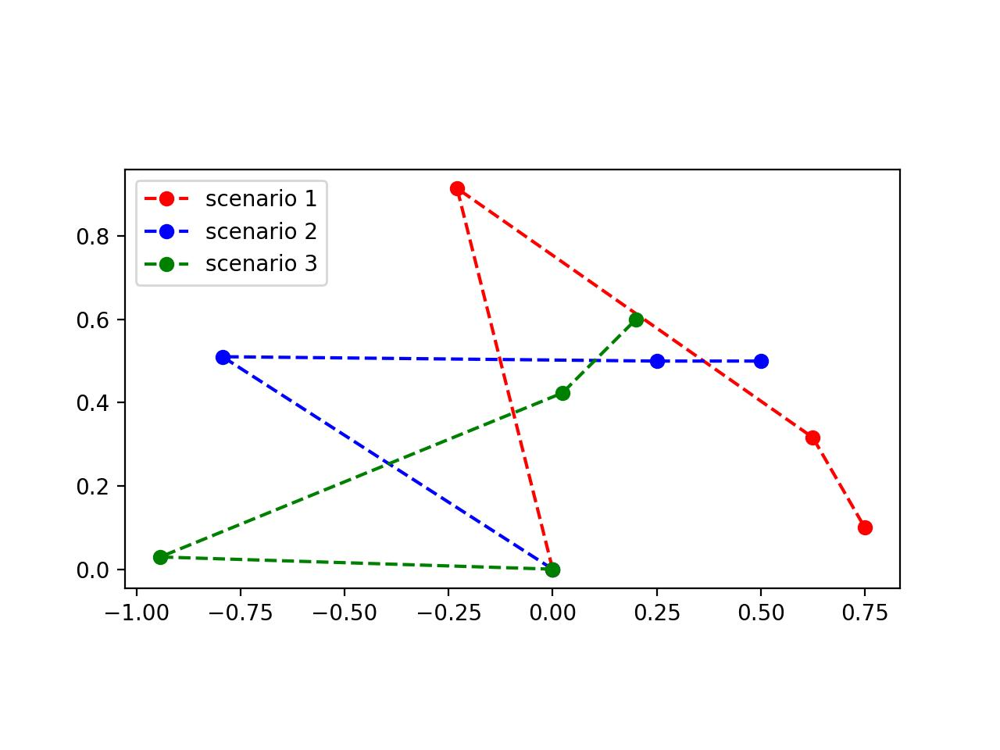

# 3DOF-robotic-arm-optimization
## Description
A program to optimize the length of each arm segment in a 3-degrees-of-freedom robotic arm to minimize torque about the main motor.

## Problem Defintion
The task is to design a 3-degrees-of-freedom, planar robotic manipulator as shown below in Figure 1. The material, arm thickness, and weight that the manipulator must support are all fixed, allowing only the lengths of each segment to be modified.

 Figure 1: Robotic Manipulator 

The table below presents the 3 configurations the robotic manipulator must past through during operation.

| Positions | Link 3 Orientations |
| :-------: | :-----------------: |
| [0.75, 0.1] | -60&deg; |
| [0.5, 0.5] | 0&deg; |
| [0.6, 0.2] | 45&deg; |

 
Therefore, the objective is to determine the three lengths (l1, l2, l3), so that the base motor (located at the origin) requires the least possible torque in each scenario (T1, T2, T3) to maintain static equilibrium of the manipulator.

## Requirements
1. The manipulator supports a load of 5kg
2. The manipulator should be capacble of reaching a minimum distance of 1m

## Considerations
1. The weight of each arm segement varies differently with length (Figure 2)

 Figure 2: Arm weight based on lengths 

2. All joints are weightless
3. The gripper has negligible weight
4. Assume the joints of the manipulator are locked (excluding the joint attached to the base motor)

## Optimization Algorithm
This program optimizes the lengths of the robotic manipulator using the `minimize()` function from the [scipy](https://github.com/scipy/scipy) library with the `trust-constr` algorithm.

The objective function `optimize_scenarios(x)` takes an array of 3 lengths and calculates the joint positions of each member that meet the requirements of each scenario. The moment about the origin generated by the mass and the arm segments is calculated for each scenario and the norm of that vector is returned.

The following constraints and bounds were applied to the `trust-constr`:
1. The difference between l1 and l2 was constrained to be within -0.1 -> 0.1 and the total length was constrained to be greated than 1 using the `LinearConstraint` class.
2. l1 and l2 were bounded between 0 -> infinity and l3 was bounded between 0 -> 0.25

## Solution
The algorithm was run with an initial guess of [0.5, 0.5, 0.1]. After 63 iterations the program obtained a minimum torque of 42.11 N&middot;m with lengths [0.9434, 1.043, 0.25]. The solution to each scenario was then plotted as in Figure 3 below.

 Figure 3: Solution positions 

## Conclusion
The simplicity of this project allowed our group to attempt to solve the problem in a more practical and novel way. We were able to learn new tools such as [scipy](https://github.com/scipy/scipy), explore optimization, and see how different algorithms work. While the current solution may not be the most optimal or efficient for the given problem the learning experience was by far more valuable. If there are any recommendations on how to improve our code please do not hesitate to reach out to us.
