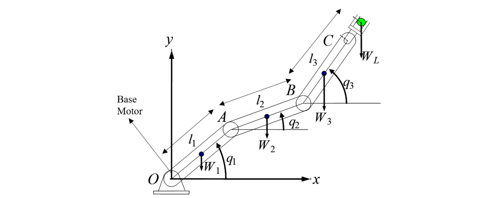
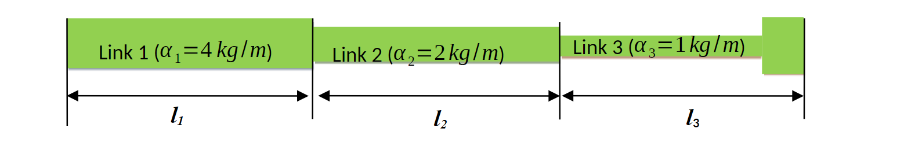

# 3DOF-robotic-arm-optimization
## Description
A program to optimize the length of each arm segment in a 3-degrees-of-freedom robotic arm to minimize torque about the main motor.

## Problem Defintion
The task is to design a 3-degrees-of-freedom, planar robotic manipulator as shown below in Figure 1. The material, arm thickness, and weight that the manipulator must support are all fixed, allowing only the lengths of each segment to be modified.

 Figure 1: Robotic Manipulator 

The table below presents the 3 configurations the robotic manipulator must past through during operation.

| Positions | Link 3 Orientations |
| :-------: | :-----------------: |
| [0.75, 0.1] | -60&deg; |
| [0.5, 0.5] | 0&deg; |
| [0.6, 0.2] | 45&deg; |

Therefore, the objective is to determine the three lengths (l1, l2, l3), so that the base motor (located at the origin) requires the least possible torque in each scenario (T1, T2, T3) to maintain static equilibrium of the manipulator.

## Requirements
1. The manipulator supports a load of 5kg
2. The manipulator should be capacble of reaching a minimum distance of 1m

## Considerations
1. The weight of each arm segement varies differently with length (Figure 2)

 Figure 2: Arm weight based on lengths 

2. All joints are weightless
3. The gripper has negligible weight
4. Assume the joints of the manipulator are locked (excluding the joint attached to the base motor)

## Optimization Algorithm
This program optimizes the lengths of the robotic manipulator using the `minimize()` function from the [scipy](https://github.com/scipy/scipy) library with the `trust-constr` algorithm.